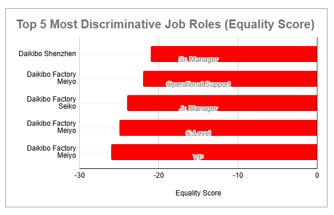

# ⚖️ Gender Pay Equality Analysis — Deloitte Job Simulation

**Objective:** Investigate gender pay equality across Daikibo Industrials using provided **Equality Scores** (–100 to +100, where 0 = ideal equality). The goal was to classify job roles into fairness categories and identify patterns across factories.

**Tools:** Microsoft Excel  
**Skills showcased:** Data classification, business-rule implementation, HR analytics, data storytelling

---

## 📝 Classification Logic

- **Fair:** –10 ≤ score ≤ 10  
- **Unfair:** –20 ≤ score ≤ –11 OR 11 ≤ score ≤ 20  
- **Highly Discriminative:** score < –20 OR score > 20  

---

## 📊 Visualizations

**Equality Class Distribution by Factory**  
(./assets/equality_class_by_factory.png)

**Top 5 Most Discriminative Roles**  

---

## 🔑 Key Insights

1. **Factories differ significantly** — Berlin and Shenzhen had a higher share of Fair roles, while Meiyo and Seiko showed more Highly Discriminative roles.  
2. **Leadership positions show stronger inequality** — senior roles like C-Level, VP, and Sr. Manager had the most extreme scores.  
3. **Need for targeted interventions** — companies should conduct pay audits, especially in high-level roles, and implement stronger equality policies.  

---

## 📂 Files

- `/data/Task 5 Equality Table.xlsx` — original dataset (Equality Score by factory & job role)  
- `/data/equality_classified.xlsx` — processed version with Equality Class column  
- `/assets/` — screenshots of Excel charts  

---

## 🔎 How to View

1. Open the **Excel file** in `/data/` to see raw and classified data.  
2. View the charts in the `/assets/` folder.  
3. The visuals are also embedded above for quick review.  

---

## 📜 License

MIT © Oluwatosin Olaniyan
